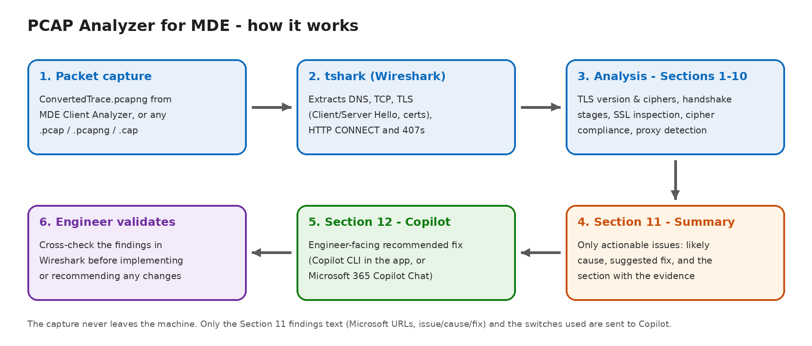

# PCAP Analyzer for MDE

Diagnose Microsoft Defender for Endpoint (MDE) connectivity problems from a packet capture in minutes.

PCAP Analyzer reads a capture (for example `ConvertedTrace.pcapng` from MDE Client Analyzer) and checks every URL Defender for Endpoint needs, commercial and US Gov. It flags SSL/TLS inspection, handshake failures, missing cipher suites, and proxy-authentication blocks, then summarizes only the issues that need action. Optionally, Copilot adds a short recommended fix.

*Created by Bryan Rigano.* This is an independent community tool. It is not an official Microsoft product and is not supported by Microsoft.

<!-- Add a screenshot of the app after an -All run here:   -->

## Features

- **Full MDE URL sweep** (`-All`) - SSL-inspection check and handshake pass/fail for every documented commercial and US Gov (GCC / GCC High / DoD) MDE and Defender Antivirus URL.
- **Single-host deep dive** (`-Domain`) - TLS version and ciphers offered vs. negotiated, per-stage handshake results (SYN / SYN-ACK / ACK / TLS), byte counts, and Microsoft cipher-suite compliance. Add `-Detailed` for every Client Hello and Server Hello.
- **Proxy detection** - HTTP CONNECT tunnels and `407 Proxy Authentication Required`, a common failure for the Sense service, which runs as SYSTEM.
- **Actionable summary** - Only real issues, each with a likely cause, a suggested fix, and the section holding the evidence.
- **Copilot recommended fix (optional)** - GitHub Copilot CLI answers in the app, or the prompt goes to Microsoft 365 Copilot Chat. Only the summary text is sent, never the capture.
- **Windows app or PowerShell script** - The same analyzer, with a GUI or from the command line.

## How it works



## Quick start

**Requirements:** Windows 10/11 and [Wireshark](https://www.wireshark.org/download.html) (for `tshark.exe`). The GitHub Copilot CLI is optional.

1. Download `PCAP-Analyzer.exe` from the [latest release](../../releases/latest).
2. Launch it, select a capture, leave **-All** ticked, and click **Run analysis**.
3. Optional: set up Copilot with the **Install Copilot CLI** and **Sign in** buttons - see the [Setup Guide](docs/setup-guide.md).

> Captures from MDE Client Analyzer are often readable by administrators only. If the app can't read one, it offers to restart as administrator.

**Command line:**

```powershell
.\src\PCAP-Analyzer.ps1 -PcapPath .\ConvertedTrace.pcapng -All -TsharkPath "C:\Program Files\Wireshark\tshark.exe"
.\src\PCAP-Analyzer.ps1 -PcapPath .\ConvertedTrace.pcapng -Domain winatp-gw-eus3.microsoft.com -Detailed -TsharkPath "C:\Program Files\Wireshark\tshark.exe"
```

## Recommended workflow

1. Run **-All** on every new capture.
2. Re-run **-Domain `<hostname>`** for each URL marked `[FAILED]` or `[WARNING]`, adding **-Detailed** if needed.
3. Review **Section 11** (actionable issues) and **Section 12** (Copilot's recommended fix).
4. **Validate the findings in Wireshark** before acting on them.

## Documentation

| Guide | Contents |
|---|---|
| [Setup Guide](docs/setup-guide.md) | Installation, Copilot CLI setup with screenshots, and the switches in detail |
| [User Reference](docs/user-reference.md) | Every section, status tag, failure stage, and common finding explained |
| [Quick Reference](docs/quick-reference.md) | One-page cheat sheet and command-line examples |
| [Troubleshooting & FAQ](docs/troubleshooting-faq.md) | Error messages and fixes, and common questions |
| [Changelog](CHANGELOG.md) | Version history |

## Privacy

- The capture is read locally by tshark and never uploaded.
- With Copilot on, only the Section 11 findings text (Microsoft URLs and issue / cause / fix) and the switches used are sent. IP addresses and file names are not sent.
- Set **Copilot: Off** (or `-Copilot Off`) to keep the entire run local.

## Build the app from source

```powershell
cd src
powershell.exe -ExecutionPolicy Bypass -File .\Build-PcapAnalyzerExe.ps1
```

The build uses [PS2EXE](https://github.com/MScholtes/PS2EXE) (installed for the current user on first run) to package the GUI and analyzer into `PCAP-Analyzer.exe`. Pass `-CertThumbprint <thumbprint>` to sign it.

## Contributing and issues

Bug reports and suggestions are welcome through [Issues](../../issues). **Never attach packet captures or customer data** - share the saved text output with hostnames and IPs redacted instead.

## License

Released under the [MIT License](LICENSE).

## Disclaimer

Results are generated automatically from packet-capture analysis and AI-assisted recommendations. Validate findings in Wireshark before acting on them or sharing them with customers, particularly where a result appears inconsistent or unexpected. This software is provided "as is", without warranty of any kind.

Microsoft, Microsoft Defender, and GitHub Copilot are trademarks of the Microsoft group of companies. Wireshark is a registered trademark of the Wireshark Foundation.
