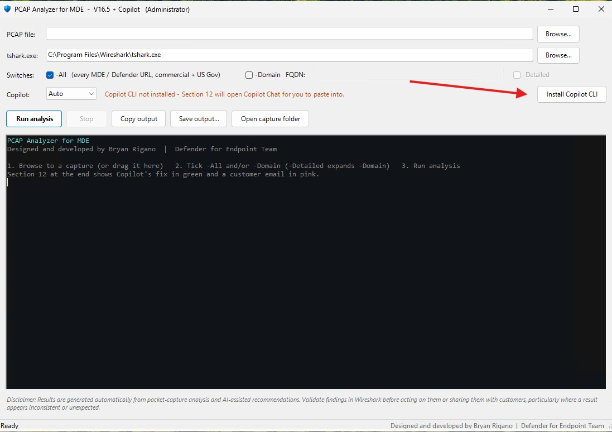
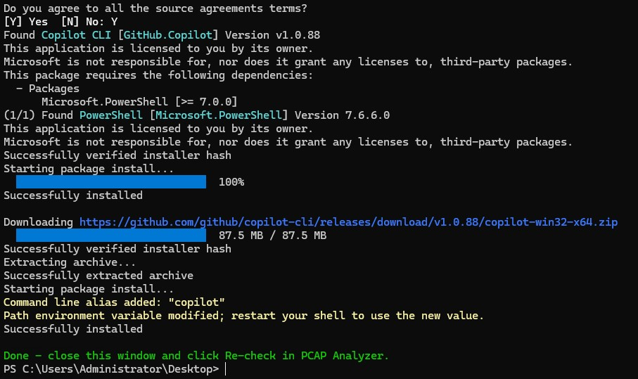
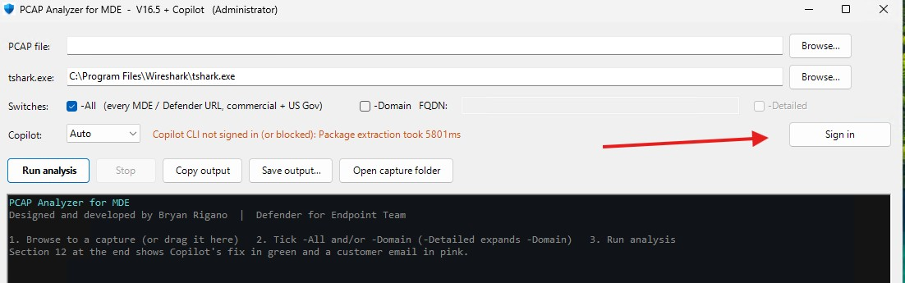
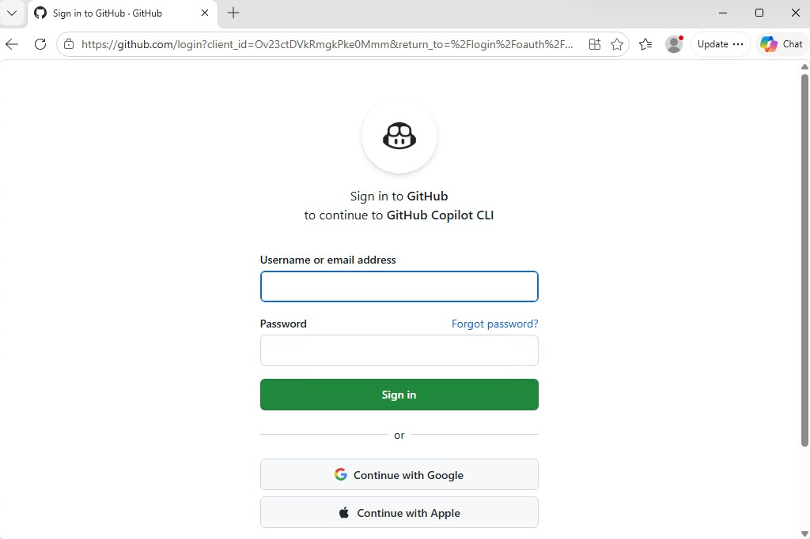

# PCAP Analyzer for MDE - Setup and User Guide

*Created by Bryan Rigano*

*[Home](../README.md) | [Setup Guide](setup-guide.md) | [User Reference](user-reference.md) | [Quick Reference](quick-reference.md) | [Troubleshooting & FAQ](troubleshooting-faq.md)*

PCAP Analyzer for MDE reviews a packet capture (for example, the `ConvertedTrace.pcapng` from MDE Client Analyzer) for Microsoft Defender for Endpoint connectivity problems. It checks TLS/SSL inspection, handshake failures, cipher compliance, and proxy authentication. Copilot then suggests a fix for any issues it finds.

---

## Before you start

| Requirement | Notes |
|---|---|
| Windows 10 / 11 | `PCAP-Analyzer.exe` from the [Releases](../../../releases) page. |
| Wireshark | Provides `tshark.exe`. Install it before the first run. The app finds it in `C:\Program Files\Wireshark\` automatically. |
| GitHub account with Copilot access | Needed for the Copilot CLI sign-in (step 4). |
| Administrator rights (recommended) | Captures written by MDE Client Analyzer are often readable by administrators only. If the app can't read a capture, it offers to restart as administrator. |

> **Tip:** Install and sign in to Copilot from the same kind of window you'll use for analysis. If you normally run the app as administrator, do the setup steps below with the app running as administrator too. The Copilot CLI installs per user.

---

## One-time setup: Copilot CLI

The Copilot CLI lets the app print Copilot's recommended fix directly in the output window. Without it, the app still works: Section 12 copies the prompt to your clipboard and opens Microsoft 365 Copilot Chat for you to paste into.

### Step 1 - Click "Install Copilot CLI"

Launch `PCAP-Analyzer.exe`. On a new machine, the **Copilot** row shows *"Copilot CLI not installed"*. Click **Install Copilot CLI**.



### Step 2 - Follow the install prompts (PowerShell 7 + Copilot CLI)

A PowerShell window opens and runs the install through `winget`:

1. When asked **"Do you agree to all the source agreements terms?"**, type **Y** and press Enter.
2. winget installs the required dependency first: **PowerShell 7** (`Microsoft.PowerShell`).
3. winget then downloads and installs the **Copilot CLI** (`GitHub.Copilot`, about 88 MB) from GitHub.
4. When the green message **"Done - close this window and click Re-check in PCAP Analyzer."** appears, close the window.



**Check the PowerShell version (must be 7.6.6 or later).** In any PowerShell window:

```powershell
pwsh --version
```

If the version is lower than **7.6.6**, update it:

```powershell
winget upgrade Microsoft.PowerShell
```

### Step 3 - Click "Re-check", then "Sign in"

Back in PCAP Analyzer, click **Re-check**. The status changes to *"Copilot CLI not signed in"* and the button changes to **Sign in**. Click **Sign in**.



> **Note:** On the first check, the status text may show a technical message such as *"Package extraction took 5801ms"*. That is the Copilot CLI unpacking itself on first launch, not an error. Continue with **Sign in**.

### Step 4 - Sign in to GitHub

A console window opens and your browser shows **"Sign in to GitHub to continue to GitHub Copilot CLI"**.

1. Sign in with the GitHub account that has Copilot access.
2. If the console window shows a one-time code, enter it on the GitHub page when prompted.
3. Approve (authorize) GitHub Copilot CLI.



When the console window closes, the app tests the connection automatically. Setup is complete when the status turns green:

> **Copilot CLI ready - the recommended fix prints in this window.**

You only do this once per user, per machine.

### Setup troubleshooting

| What you see | What to do |
|---|---|
| Status still says *not installed* after Step 2 | Click **Re-check**. If it still fails, close and reopen the app so it picks up the new PATH. |
| Status stays *not signed in* after Step 4 | Click **Sign in** again and finish the GitHub page. Hover over the status text to see Copilot's exact message. |
| Message mentions *policy* or *not enabled* | Copilot CLI is disabled for your GitHub account by your organization. Use **Copilot: Chat** instead. |
| Proxy or certificate error | Something is intercepting HTTPS to GitHub. Use **Copilot: Chat** until it's resolved. |

---

## Running an analysis

1. **PCAP file** - Click **Browse...**, or drag a capture onto the window.
2. **tshark.exe** - Filled in automatically if Wireshark is installed.
3. **Switches** - Tick **-All**, **-Domain** (with an FQDN), or both. **-Detailed** is available when **-Domain** is ticked.
4. **Copilot** - **Auto** (recommended) uses the Copilot CLI when it's ready, otherwise Copilot Chat. **Chat** always opens Copilot Chat. **Off** skips Section 12.
5. Click **Run analysis**. Output streams into the window.
6. Use **Copy output**, **Save output...** (`.rtf` keeps the colors), or **Open capture folder** as needed.

---

## The switches

### -All - full MDE connectivity sweep

**What it is:** A health check of every documented URL that Defender for Endpoint needs, across **both** the commercial and US Gov (GCC / GCC High / DoD) URL lists. It covers the MDE sensor/EDR URLs plus Defender Antivirus cloud protection (MAPS), Windows Update, and ADL URLs. No domain is required.

**What it runs:**

| Section | What it checks |
|---|---|
| 6 - SSL Inspection Check (commercial) | Whether any commercial MDE URL's certificate was re-signed by something other than a known public/Microsoft CA, or its TLS was downgraded. |
| 7 - Handshake Status (commercial) | Pass / fail / failing stage for every commercial MDE URL found in the capture. |
| 8 - SSL Inspection Check (US Gov) | The same inspection check against the GCC / GCC High / DoD URL list. |
| 9 - Handshake Status (US Gov) | Pass / fail / failing stage for every US Gov URL found. |
| 10 - Proxy Detection *(always runs)* | HTTP CONNECT tunnels (explicit proxy) and `407 Proxy Authentication Required` responses. Proxy authentication is a common failure, because the Sense service runs as SYSTEM. |
| 11 - Summary & Recommended Actions *(always runs)* | Only the real, actionable issues: connectivity failures, SSL inspection, missing cipher suites, and proxy authentication. Each has a likely cause, a suggested fix, and the section with the evidence. |
| 12 - Copilot Action Plan *(always runs unless Copilot is Off)* | Copilot's recommended fix for the Section 11 findings, shown in green. |

**When to use it:** As the first pass on any new capture. It checks the full required URL surface, not just the URL you already suspect, so it often surfaces problems you didn't know to look for.

**Limitation:** -All reports pass / fail / stage per URL, not *why* at the cipher or byte level. Use -Domain for that.

### -Domain - deep dive on one host (FQDN required)

**What it is:** A detailed analysis of **one** hostname. Tick **-Domain** and enter the FQDN in the box next to it.

**Enter the hostname only.** No `https://`, no path, no port.

| Correct | Incorrect |
|---|---|
| `winatp-gw-eus3.microsoft.com` | `https://winatp-gw-eus3.microsoft.com/` |
| `us-v20.events.data.microsoft.com` | `us-v20.events.data.microsoft.com:443` |

**What it runs for that host:**

| Section | What it shows |
|---|---|
| 1 - TLS Version | TLS version the device offered vs. the version actually negotiated. |
| 2 - Ciphers | Cipher suites offered by the device vs. the suite the server selected. |
| 3 - Handshake Status | Each session broken into stages (SYN, SYN-ACK, ACK, TLS), showing exactly where a failing connection stops. |
| 4 - Outbound Connectivity | Per-IP connection results with byte counts. |
| 5 - Microsoft TLS Cipher Compliance | The offered cipher suites compared against Microsoft's required TLS 1.2 / 1.3 suites. |
| 6 - SSL Inspection Check | Runs automatically alongside -Domain. |
| 10, 11, 12 | Proxy detection, summary, and Copilot action plan, as above. |

**When to use it:** After -All flags a URL as **[FAILED]** or **[WARNING]**. Re-run with that exact hostname to get the cipher-level and byte-level detail needed to root-cause or document the issue.

**Combining:** You can tick **-All** and **-Domain** together. Both run in the same pass.

> When only -Domain is used, only that one host is analyzed, and Copilot's recommendation will say so.

### -Detailed - full per-frame output for -Domain

**What it is:** A checkbox that expands the -Domain results from a summary into **full forensic detail**. It is only available when **-Domain** is ticked, because it has no effect on -All.

**What it adds:**

- Every individual **Client Hello** (what the device offered, frame by frame)
- Every individual **Server Hello** (what the server answered)
- Full **per-stream and per-IP conversation statistics** for the host

**When to use it:** When the -Domain summary doesn't fully explain an anomaly, or when you need frame-level evidence for escalation or documentation. Expect much longer output.

---

## Recommended workflow

1. Run **-All** on the capture as the first pass.
2. For any URL marked **[FAILED]** or **[WARNING]**, run **-Domain `<that exact hostname>`**.
3. Add **-Detailed** if you need frame-level evidence.
4. Review Section 11 and Copilot's recommended fix in Section 12.
5. **Validate the findings in Wireshark** before acting on them or sharing them with the customer.

---

## Where files are saved

| Item | Location |
|---|---|
| Copilot's recommended fix | Next to the capture: `<capture>_CopilotPlan_<date-time>.md` |
| Saved output (**Save output...**) | Wherever you choose. `.rtf` keeps the colors, `.txt` is plain text. |
| App settings (tshark path, last capture, Copilot mode) | `%LOCALAPPDATA%\PCAP-Analyzer\gui-settings.json` |

---

## Disclaimer

Results are generated automatically from packet-capture analysis and AI-assisted recommendations. Validate findings in Wireshark before acting on them or sharing them with customers, particularly where a result appears inconsistent or unexpected.
